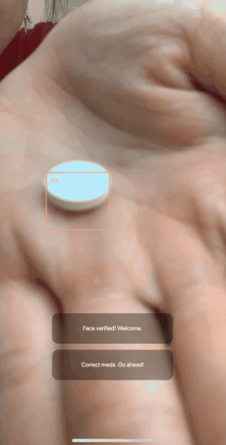

### Misc.
- This is a project archive.
- Project stack: **Flutter, YOLOv2 mobile**
- Project dated **Oct 2019**
- This only contains the client app source code. 

# Pillpal ([Hackathon](https://www.axa.com.hk/zh/article/axa_hack_for_health) project)
- Using mobile YOLOv2 to detect pills type and quantity, followed by poseNET for the action of taking a pill.
- Built on flutter with native CoreML implementation of algorithms
- A solution to battle drug non-adherence with machine learning and community network.
- Winning solution of the [Hong Kong AXA-Microsoft Hackathon 2019](https://en.prnasia.com/releases/apac/axa-hong-kong-and-macau-hosts-its-first-hack-for-health-challenge-to-explore-innovations-for-health-protection-262897.shtml)

